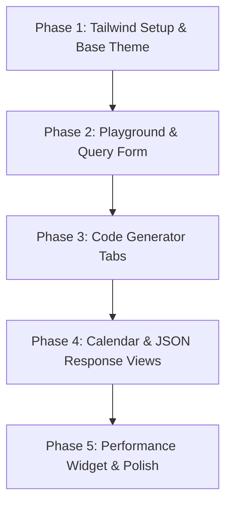

# Frontend Modernization Plan: India Calendar API Developer Portal
**Date:** May 29, 2026  
**Document Reference:** `2026-05-29-FRONTEND-DEVELOPMENT.md`

---

## 1. Vision & Goals
To transform the current React-based frontend (`/frontend`) from a basic query tool into a high-end, developer-first portal inspired by modern API platforms like `mfapi.in` and `Stripe Docs`.

* **Premium UI/UX**: Introduce a professional developer-centric dark mode theme.
* **Tailwind CSS Styling**: Utilize Tailwind CSS (v3) for utility-first responsive styling, micro-animations, glassmorphic effects, and clean layout controls.
* **Frictionless Playground**: Enable instant query building, code generation, and visual responses on a single, high-performance page.
* **Interactive Visualization**: Offer both raw JSON previews and a beautiful interactive calendar UI showing selected holidays.
* **Operational Transparency**: Add real-time latency and status reporting.

---

## 2. Design System & Theming (Tailwind CSS)

We will configure Tailwind CSS in `tailwind.config.js` and structure our utility classes as follows:

| Design Element | Tailwind Utility Classes | Description |
| :--- | :--- | :--- |
| **Primary Theme** | `bg-[#0B0F19] text-slate-100` | Deep midnight dark mode background with clean slate text. |
| **Glassmorphic Cards**| `bg-slate-900/75 backdrop-blur-md border border-white/10` | Sleek semi-transparent card panels. |
| **Primary Accent** | `text-violet-400 bg-violet-600 hover:bg-violet-700` | Electric Violet for primary buttons, focus states, and highlights. |
| **Secondary Accent** | `text-cyan-400 bg-cyan-500/10 border border-cyan-500/20` | Neon Cyan for secondary actions and code element highlights. |
| **UI Fonts** | `font-sans` (Inter or Outfit) | Set as the primary sans font. |
| **Code Fonts** | `font-mono` (JetBrains Mono) | Applied to request URLs, JSON tree, and copyable snippets. |
| **Gazetted Holiday** | `bg-red-500/10 text-red-400 border border-red-500/20` | High-visibility warning indicators on the calendar. |
| **Restricted Holiday**| `bg-amber-500/10 text-amber-400 border border-amber-500/20` | Moderate-visibility warning indicators on the calendar. |
| **Observances/Other** | `bg-blue-500/10 text-blue-400 border border-blue-500/20` | Informational markers on the calendar. |

---

## 3. High-Fidelity UI Layout

The portal will use a layout structured to prevent scrolling fatigue and make code-copying instant:

```
+-----------------------------------------------------------------------------------+
|  [Logo] India Calendar API         [Live Status: Operational (12ms)] [GitHub Icon]|
+-----------------------------------------------------------------------------------+
|                                                                                   |
|  HERO: Truly free, keyless REST API serving Indian holidays.                      |
|                                                                                   |
|  +-----------------------------------------------------------------------------+  |
|  | PLAYGROUND & QUERY BUILDER                                                  |  |
|  | Region: [Karnataka (KA) v]   Endpoint: [/v1/holidays v]   Year: [2026]      |  |
|  | Request URL: GET https://api.indian-calendar.com/v1/holidays?region=KA      |  |
|  +-----------------------------------------------------------------------------+  |
|                                                                                   |
|  +-------------------------------------+  +------------------------------------+  |
|  | CODE SNIPPET GENERATOR              |  | LIVE RESPONSE VISUALIZER           |  |
|  | [ cURL ] [ JavaScript ] [ Python ]  |  | [ Pretty JSON ] [ Calendar View ]  |  |
|  | ----------------------------------  |  | ---------------------------------  |  |
|  | curl -X GET "https://api..."        |  | {                                  |  |
|  |                                     |  |   "date": "2026-01-26",            |  |
|  |                                     |  |   "name": "Republic Day",          |  |
|  | [Copy Code]                         |  |   "type": "gazetted_holiday"       |  |
|  |                                     |  | }                                  |  |
|  +-------------------------------------+  +------------------------------------+  |
|                                                                                   |
|  +-----------------------------------------------------------------------------+  |
|  | API DOCUMENTATION & SCHEMA QUICK-REFERENCE                                  |  |
|  +-----------------------------------------------------------------------------+  |
+-----------------------------------------------------------------------------------+
```

---

## 4. Feature Blueprint

### Feature 1: The Interactive Query Builder
* **Dynamic Form Fields**: Dropdowns for selecting API endpoints (e.g., `/v1/holidays`, `/v1/date/is-holiday`, `/v1/date/next-holiday`, `/v1/holidays/range`, `/v1/calendar`).
* **Fuzzy Search Region Selector**: A search input supporting autocompletion for central and 36 states/UTs (e.g. typing "Karn" automatically highlights "Karnataka (KA)").
* **Reactive Request URL**: A read-only address bar displaying the active endpoint URL changing in real-time as users modify the parameters.

### Feature 2: Code Snippet Generator
* A tabbed component showing how to request the exact current URL in:
  * **cURL**: `curl -X GET "..."`
  * **JavaScript (Fetch)**: `fetch("...")`
  * **Python (Requests)**: `import requests; r = requests.get("...")`
  * **Go**: `http.Get("...")`
* **Single-click Copy**: "Copy to Clipboard" button with transient "Copied!" feedback.

### Feature 3: Dual-Mode Response Visualizer
* **Pretty JSON Tab**: Syntactically formatted JSON tree representation of the API payload.
* **Interactive Calendar Tab**: 
  * Renders a month-by-month grid layout of the requested year/range.
  * Holiday dates are color-coded based on holiday type (Gazetted, Restricted, Observance).
  * Hovering or clicking a holiday date opens a tooltip showing name, day of the week, and classification details.

### Feature 4: Health & Performance Widget
* Dynamically pings the backend `/v1/holidays?country=IN&year=2026&region=central` on page load.
* Calculates roundtrip time and displays active latency (e.g. "Response Time: 28ms").
* Renders an uptime guarantee badge ("99.9% Uptime").

---

## 5. Implementation Roadmap (Phases)



### Phase 1: Tailwind Setup & Styling Foundations
* Install Tailwind CSS, PostCSS, and Autoprefixer in `/frontend`.
* Generate and configure `tailwind.config.js` to target source templates.
* Add Google fonts (Inter & JetBrains Mono) to `index.html`.
* Update global base classes in `/frontend/src/index.css` to load Tailwind directives (`@tailwind base`, `@tailwind components`, `@tailwind utilities`).

### Phase 2: Playground & Input Inputs (Tailwind Flexbox/Grid)
* Structure the layout container using Tailwind flexbox and grid classes (`grid grid-cols-1 md:grid-cols-2 gap-6`).
* Standardize the state management in `App.jsx` to synchronize user queries.
* Implement the fuzzy autocomplete selector for states.
* Draw up the read-only live URL preview widget.

### Phase 3: Code & JSON Outputs
* Program the text-formatting templates for code blocks.
* Incorporate clipboard copying triggers.
* Implement a JSON renderer to format payloads beautifully.

### Phase 4: Dynamic Calendar Renderer
* Construct a lightweight JS calendar layout algorithm.
* Overlay holiday markers on matching calendar dates.
* Add tooltips and transitions for calendar interaction.

### Phase 5: Live Check & Fine-tuning
* Integrate real-time API ping measurements on page load.
* Refine animations (micro-interactions on buttons, tabs, dropdowns).

---

## 6. Feedback & Approvals
Please review this design layout and roadmap. Once approved, we will proceed to modify the frontend files (`frontend/src/App.jsx` and `frontend/src/index.css`) to build the new visual experience.
