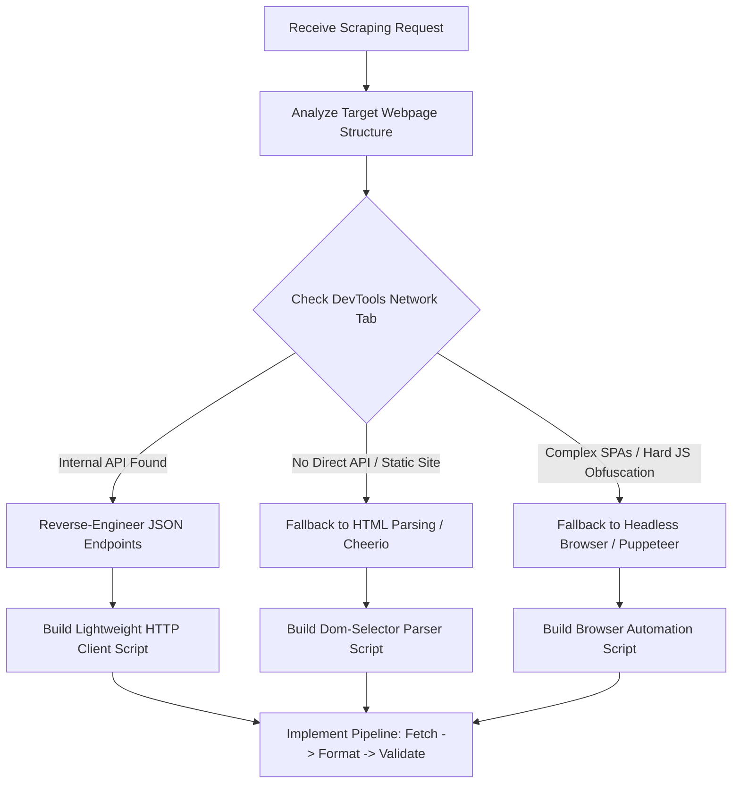

# Scraping Methodology: India Calendar API (ICS to JSON)

This document provides a step-by-step explanation of how the calendar scraping pipeline was designed, engineered, and executed. It is written as a methodology guide so that both human engineers and other AI agents can understand the technique used, the rationale behind it, and how to apply these principles to similar scraping tasks.

---

## 1. Executive Summary & Rationale

When tasked with gathering holiday calendars for the Central Government of India along with **36 States and Union Territories (UTs)** for the year 2026, the naive approach would involve browser automation:

1. Launching a headless browser (e.g., Puppeteer, Playwright, or Selenium).
2. Navigating to `https://www.india.gov.in/calendar` and 36 other state URLs.
3. Simulating clicks on the **"Sync Calendar"** button on each page to download the `.ics` file.
4. Parsing the downloaded files and restructuring them into JSON.

### Why the Naive Approach is Suboptimal:
- **High Resource Overhead:** Headless browsers consume significant CPU and memory.
- **Latency:** Navigating and waiting for DOM rendering takes seconds per page (totaling several minutes for 37 pages).
- **Flakiness:** Any UI change, layout shift, or slow network response can cause selectors to fail.
- **Environment Dependencies:** Requires browser installations, making it less portable in lightweight execution environments.

### The Engineered Approach (Reverse Engineering the API):
Instead of interacting with the frontend DOM, we analyzed the network layer. We discovered that the site does not host static `.ics` files. When a user clicks "Sync Calendar", the frontend makes a POST request to an internal CMS endpoint to fetch raw data, and then calls a second API to dynamically generate and download the `.ics` file. 

By identifying and directly calling these internal JSON endpoints, we built a script that completes the entire download, generation, parsing, and schema validation process in **seconds** with **100% reliability** and **zero browser dependencies**.

---

## 2. Technical Step-by-Step Walkthrough

The scraping pipeline is implemented in Node.js in [parse-ics.js](file:///e:/calendar-api/scripts/parse-ics.js). Here is the step-by-step execution path:

### Step 1: Mapping the Metadata
We mapped the 37 target regions with their readable names and official aliases used by the website's router:
```javascript
const regions = [
  { name: "Central Government", alias: "central", isCentral: true },
  { name: "Andhra Pradesh", alias: "andhra-pradesh" },
  // ... other states/UTs
];
```

### Step 2: Querying the CMS API directly
Instead of parsing HTML, we found that the website is backed by a headless CMS API. We bypassed the UI and sent a POST request directly to the API endpoint:
* **Endpoint:** `https://www.india.gov.in/internal/cms`
* **Method:** `POST`
* **Payload Structure:** 
  ```json
  { "route": "/api/state-holidays?populate=*&filters[state_dept_org][alias]=<alias>&filters[date][$gte]=2026-01-01&filters[date][$lte]=2026-12-31&pagination[pageSize]=100&sort=id" }
  ```
This endpoint responds instantly with a clean JSON payload containing the raw holiday events for that specific state and year.

### Step 3: Triggering the Server-side ICS Generator
To obtain the `.ics` files as requested by the specification, we sent the raw holiday JSON objects back to the site's calendar converter API:
* **Endpoint:** `https://www.india.gov.in/api/calendar-ics`
* **Method:** `POST`
* **Payload Structure:** 
  ```json
  { "holidays": [ ...raw holiday JSON objects from Step 2... ] }
  ```
The server responds with the standard VCALENDAR formatted string. We write this response to the disk under `ics/IN_<REGION_CODE>_2026.ics`.

### Step 4: Local ICS parsing & Normalization
Once the local `.ics` file is saved, the script reads it and performs the following data normalization steps:
1. **Unfolding:** Standard ICS formats fold lines longer than 75 characters. We unfold them using a regex: `fileContent.replace(/\r?\n[ \t]/g, '')`.
2. **Event Extraction:** Split the file contents by `BEGIN:VEVENT` to isolate individual holidays.
3. **Field Extraction:** Use regex/string search to extract:
   - `SUMMARY:` → Normalized to holiday name (unescaping characters like commas).
   - `DTSTART;VALUE=DATE:` → Formatted from `YYYYMMDD` to standard `YYYY-MM-DD`.
   - `DESCRIPTION:` → Used to map holiday classifications.
4. **Holiday Type Mapping:** 
   - Descriptions containing `"gazetted"` → `gazetted_holiday`
   - Descriptions containing `"restricted"` → `restricted_holiday`
   - Everything else → `observance`
5. **Sorting:** Sort the final array of holidays chronologically.
6. **Deduplication:** Check each entry to make sure duplicate events are not pushed to the array.

### Step 5: Directory Assembly & Master Indexing
- The parsed data is saved to `data/2026/IN/<REGION_CODE>/holidays.json`.
- If a region fails to load or return data, the pipeline gracefully handles it, generates an empty holidays array file (to satisfy the schema requirement), and logs the event without stopping the runner.
- Lastly, the script generates a master `INDEX.json` summarizing the regions processed, paths to their individual holiday files, total counts, and type break-downs.

---

## 3. General Framework: API-First Scraping Methodology (For AI Agents)

When an AI agent is tasked with scraping data, it should follow this systematic decision-making framework:



### Protocol for Analyzing Endpoints:
1. **Network Sniffing:** Open the Network tab in the Chrome Developer Tools, trigger the target action (such as navigation, searching, pagination, or downloading), and look for requests of type `Fetch/XHR`.
2. **Examine Payloads:** Check request headers (specifically `Content-Type`, `Cookie`, `Authorization`) and the payload format (Query Parameters, Form Data, or JSON).
3. **Verify API Lifecycle:** Can the request be repeated from a standard HTTP client (like Node's `https` or Python's `requests`) without active session cookies? If so, prioritize this.
4. **Mock and Replay:** Attempt to fetch from terminal or minimal script using identical headers. If successful, bypass UI rendering entirely.

### Rationale for AI-to-AI Transfer:
If you are an AI agent reading this to scrape another site:
- **Always look for internal APIs first.** DOM scraping is fragile; APIs are designed for structured data exchange and are inherently more stable.
- **Do not rely on selenium/puppeteer as a default tool.** Start with simple HTTP requests. Only elevate to browser automation if the site employs advanced bot protection (Cloudflare, CAPTCHAs) or generates tokens dynamically in-browser.
- **Implement fallback defaults.** In bulk operations (like querying 37 pages), write try/catch blocks that write mock or empty data to prevent the entire run from failing because of a single transient network error.
